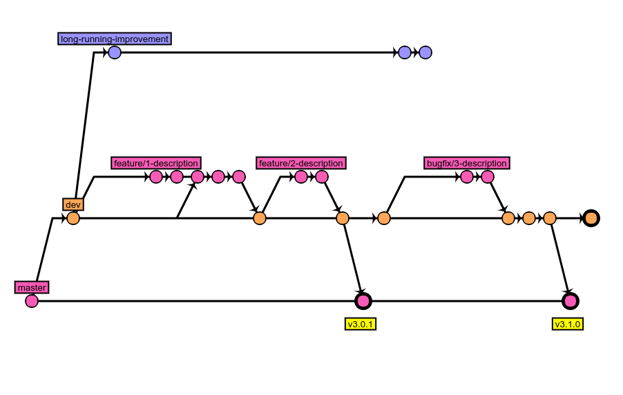

Contributing to Pattern Lab Node
================================

If you'd like to contribute to Pattern Lab Node, please do so! There is always a lot of ground to cover and something for your wheelhouse.

No pull request is too small. Check out any [up for grabs issues](https://github.com/pattern-lab/patternlab-node/labels/up%20for%20grabs) as a good way to get your feet wet, or add some more unit tests.

Developing Locally
------------------

The best way to make changes to the Pattern Lab Node core and test them is through your existing edition.

-	Fork this repository on Github.
-	Create a new branch in your fork and push your changes in that fork.
-	`npm install`
-	`npm link`
-	`cd /path/to/your/edition`
-	`npm link patternlab-node`

Guidelines
----------

-	*ALWAYS* submit pull requests against the [dev branch](https://github.com/pattern-lab/patternlab-node/tree/dev). If this does not occur, I will first, try to redirect you gently, second, port over your contribution manually if time allows, and/or third, close your pull request. If you have a major feature to stabilize over time, talk to @bmuenzenmeyer via an issue about making a dedicated `feature-branch`
-	Please keep your pull requests concise and limited to **ONE** substantive change at a time. This makes reviewing and testing so much easier.
-	Commits should reference the issue you are adressing. For any Pull Request that you send, use the template provided.
-	If you can, add some unit tests using the existing patterns in the `./test` directory
-	Large enhancements should begin with opening an issue. This will result in a more systematic way for us to review your contribution and determine if a [specifcation discussion](https://github.com/pattern-lab/the-spec/issues) needs to occur.
-	Please mention the issue number in commits if you can, so anyone can see to which issue your changes belong to. For instance:
	-	`#123 Fix resolving patterns in pattern_hunter`
	-	`Feature #42: improve improbability drive`

Coding style
------------

Two files combine within the project to define and maintain our coding style.

-	The `.editorconfig` controls spaces / tabs within supported editors. Check out their [site](http://editorconfig.org/).
-	The `.eslintrc` defines our javascript standards. Some editors will evaluate this real-time - otherwise it's run using `grunt|gulp build`

Tests
-----

Please add unit and integration tests if you can. It's always nice if our code coverage improves bit by bit (literally!). We are using [Node Tap](http://www.node-tap.org/) as test framework and [Rewire](https://github.com/jhnns/rewire) for mocking things like file system access.

Branching Scheme
----------------

 Currently Pattern Lab has the following branches:

-	**master** contains the latext stable, released version</dd>
-	**dev**: for development. *Please target pull requests against this branch.*
-	**feature-branches** for larger changes. Allows merging all changes into both `dev` easily.
-	**long running branches** for changes that involve major changes to the code, architecture and take a lot of time (i.e. making Pattern Lab async)

Development mainly happens in the `dev` branch, but you can help us a lot if you also do a pull request. When `dev` seems stable enough, we do releases by merging `dev` to `master` and creating a release tag.

Feature branches target `dev` and should be updated regularly.

Long running branches should only target the latest version of Pattern Lab and may be lagging behind a lot.

Gitter.im Chat
==============

If you have any questions or you would like to help, feel free to ask on [our Gitter.im channel](https://gitter.im/pattern-lab/node) :smiley:
